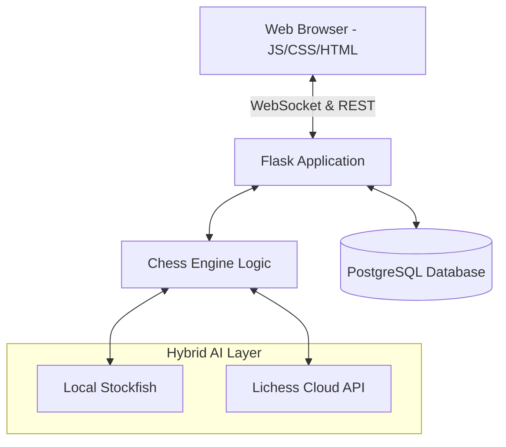
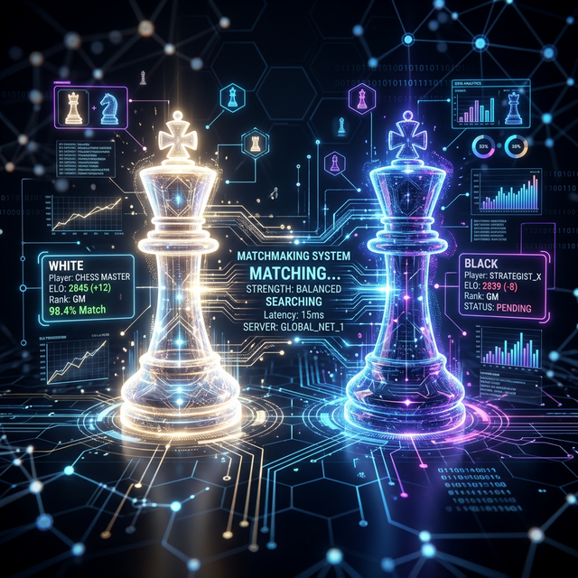

# ♟️ GrandMaster Chess

### A Full-Stack Real-Time Multiplayer Chess Platform
**Built with Flask, Socket.IO, and Stockfish AI**

[Features](#-features) • [Tech Stack](#-tech-stack) • [Architecture](#-architecture) • [How It Works](#-how-it-works) • [Roadmap](#-roadmap)

---

## 🎯 About
**GrandMaster Chess** is a modern, full-featured online chess platform designed for both casual and competitive play. It combines a sleek, responsive frontend with a robust Python backend to provide a professional chess experience anywhere.

### What makes it special:
*   **⚡ Real-time Multiplayer:** Instant move synchronization and live chat using WebSockets.
*   **🤖 Hybrid Stockfish AI:** Uses local binaries for development and the Lichess Cloud API for production deployment.
*   **⚖️ Competitive ELO System:** Professional ranking system with smart matchmaking (±200 rating range).
*   **🎨 Premium UI:** Custom-built glassmorphism design with dark/light themes and high-fidelity sound effects.
*   **🏁 Full Rule Compliance:** Complete implementation of castling, en passant, promotion, and automatic draw detection.

---

## ✨ Features

### 🎮 Four Engaging Game Modes
| Mode | Description |
| :--- | :--- |
| **Local PvP** | Classic over-the-board experience for two players on the same device. |
| **Player vs AI** | Challenge the Stockfish engine with 20 distinct difficulty levels. |
| **Computer vs Computer** | Observe the AI play against itself for analysis and learning. |
| **Online Multiplayer** | Compete globally with real-time matchmaking and ELO tracking. |

### ⚡ Core Capabilities
<table>
<tr>
<td width="50%">
<strong>♟️ Gameplay & Logic</strong>
  
• Complete FIDE rules (Castling, En Passant, Promotion) 
• 7 Time Controls (Bullet, Blitz, Rapid, Classical) 
• Legal move highlighting and move validation 
• Automatic Draw detection (3-fold, 50-move, material) 
• Move history in Standard Algebraic Notation (SAN)
</td>
<td width="50%">
<strong>🌐 Online Experience</strong>
  
• Real-time WebSocket synchronization 
• Pro matchmaking based on ELO rating 
• Integrated in-game chat and emoji reactions 
• Dynamic ELO calculation (K=32 factor) 
• Persistent game history and player stats
</td>
</tr>
<tr>
<td width="50%">
<strong>🎨 User Experience</strong>
  
• Neon-aesthetic UI (Dark/Light themes) 
• High-fidelity acoustic sound engine 
• Interactive piece animations 
• Live clocks with increment support 
• Board flipping and coordinate labels
</td>
<td width="50%">
<strong>🔐 Security & Scale</strong>
  
• Secure Auth (Bcrypt hashing) 
• Email verification with OTP integration 
• Protected REST API endpoints 
• PostgreSQL production database 
• Optimized for Render/Heroku deployment
</td>
</tr>
</table>

---

## 🛠️ Tech Stack

### Backend Infrastructure
*   **Framework:** Flask 3.0 (Python)
*   **Real-time:** Flask-SocketIO (WebSocket)
*   **Database:** SQLAlchemy (PostgreSQL/SQLite)
*   **Auth:** Flask-Login & Bcrypt
*   **Async:** Eventlet Workers

### Frontend Experience
*   **Logic:** Vanilla JavaScript (ES6+)
*   **Real-time:** Socket.IO Client
*   **Styling:** Modern CSS3 (CSS Variables, Flex/Grid)
*   **Interface:** Semantic HTML5

### Chess Intelligence
*   **Engine:** Stockfish (Local Binary + Lichess Cloud API fallback)
*   **Logic:** Custom Python Game State Engine
*   **Evaluation:** Real-time centipawn analysis

---

## 🏗️ Architecture

### Key Components:
1.  **Real-time Layer:** Socket.IO manages live updates, chat, and matchmaking state.
2.  **Hybrid AI:** Automatically switches between local binaries (dev) and Cloud API (prod).
3.  **State Engine:** Handles complex chess move validation and ELO calculations.

---

## 🎮 How It Works

### Online Matchmaking Flow
1.  **Identity:** Secure login with optional email verification.
2.  **Queue:** Join matchmaking for a specific time control (e.g., 10+0).
3.  **Sync:** Instant game creation and board synchronization via WebSockets.
4.  **Complete:** Game result updates ELO and saves history to the database.

### ELO Rating System
*   **Starting Point:** 1500 ELO.
*   **K-Factor:** 32 (standard competitive adjustment).
*   **Formula:** $E = 1 / (1 + 10^{ (dR/400) })$
*   **Matchmaking:** Prioritizes opponents within ±200 rating range.

---

## 🎯 Roadmap

- [x] Phase 1: Core chess logic and local play.
- [x] Phase 2: Stockfish AI and difficulty levels.
- [x] Phase 3: Real-time multiplayer and matchmaking.
- [x] Phase 4: ELO system and database integration.
- [ ] Phase 5: Friend system and custom invitation links.
- [ ] Phase 6: PGN Export and move-by-move analysis.
- [ ] Phase 7: Daily tactical puzzles and leaderboard.

---

## 🏆 Project Highlights
1.  **Technical Depth:** Implements a full bidirectional communication protocol.
2.  **Deployment Ready:** Includes specific configurations for Render and PostgreSQL.
3.  **Clean Code:** Highly modular Python and JavaScript structure.

---

## 🤝 Contributing
Feedback and pull requests are welcome!
1.  Fork the Project
2.  Create your Feature Branch (`git checkout -b feature/AmazingFeature`)
3.  Commit your Changes (`git commit -m 'Add some AmazingFeature'`)
4.  Push to the Branch (`git push origin feature/AmazingFeature`)

---

## 📄 License
Distributed under the MIT License. See `LICENSE` for more information.

Made with ♟️ by **PHENOGRAMMER**

⭐ **Star this repo if you like what you see!** ⭐

