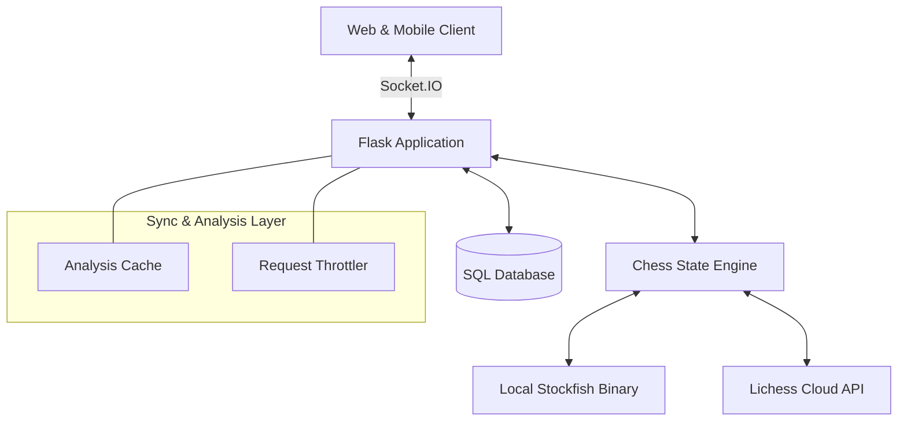

# ♟️ GrandMaster Chess

<div align="center">

### A Professional Full-Stack Real-Time Multiplayer Chess Platform
**Built with Flask, Socket.IO, and Dual-Engine Analysis**

[](https://opensource.org/licenses/MIT)
[](https://www.python.org/downloads/)
[](https://flask.palletsprojects.com/)
[](https://socket.io/)
[](https://www.docker.com/)


[](https://grandmaster-tj4w.onrender.com)

[Features](#-features) • [Quick Start](#-quick-start-docker) • [Tech Stack](#-tech-stack) • [Architecture](#-architecture) • [Roadmap](#-roadmap)

</div>

---

## 🎯 About
**GrandMaster Chess** is a modern, high-performance chess platform featuring a **state-of-the-art analysis engine**, real-time multiplayer, and a premium glassmorphism UI. Designed for serious players, it delivers deep engine insights, sub-second move synchronization, and professional UX across all devices.

### 🌟 Key Highlights:
*   **📊 Pro Analysis Engine:** Features a real-time **Dynamic Evaluation Bar** that automatically reorients to the player's perspective. Includes instant **Move Classification** (Brilliant ‼, Great ✓, Blunder ??).
*   **⚡ Synced Multi-User Analysis:** Intelligent server-side caching and request synchronization to prevent redundant analysis when multiple players review the same match.
*   **📱 Mobile-First Glassmorphism:** Fully responsive design with touch gestures, adaptive board scaling, and 60fps piece animations.
*   **🤖 Hybrid Stockfish AI:** Intelligent engine layer that uses highly optimized local binaries (dev) and rate-limited Cloud APIs (prod) with 20 difficulty levels.
*   **🚀 Cloud Optimized:** Features a background keep-alive mechanism and request throttling to ensure 99.9% uptime and API compliance on platforms like Render.

---

## ✨ Features

### 🎮 Game Modes
| Mode | Description |
| :--- | :--- |
| **Online Multiplayer** | Compete globally with real-time matchmaking and professional ELO tracking. |
| **Professional Review** | Analyze finished games with a synced **Evaluation Bar** and move-by-move quality insights. |
| **Player vs AI** | Challenge Stockfish with levels ranging from "Casual" to "Master". |
| **Local PvP** | Optimized for over-the-board play on mobile and desktop. |

### ⚡ Core Capabilities
<table>
<tr>
<td width="50%">
<strong>🧠 Game Analysis</strong>
<br><br>
• Orientation-Aware Evaluation Bar (+/- Perspective)<br>
• Move Quality Classification (Brilliant to Blunder)<br>
• Intelligent Multi-User Analysis Syncing<br>
• Real-time centipawn & mate assessment<br>
• Best Move hints and cached engine results
</td>
<td width="50%">
<strong>🌐 Online Experience</strong>
<br><br>
• Ultra-low latency WebSocket synchronization<br>
• Matchmaking based on ELO (±200 rating range)<br>
• Integrated live chat and secure profiles<br>
• Live clocks with custom increment support<br>
• Automatic keep-alive and idling prevention
</td>
</tr>
<tr>
<td width="50%">
<strong>🎨 User Experience</strong>
<br><br>
• Premium Glassmorphism UI (Neon-Dark theme)<br>
• Reactive board flip and scaling logic<br>
• Smooth piece animations and haptic feedback<br>
• High-fidelity chess sound engine<br>
• Mobile-optimized board gestures
</td>
<td width="50%">
<strong>🔐 Scale & Deployment</strong>
<br><br>
• Dockerized for instant environment setup<br>
• Gunicorn + Eventlet for high-concurrency sockets<br>
• SQLAlchemy persistence layer<br>
• Request throttling and API rate limiting<br>
• Production-ready for Render, Heroku & AWS
</td>
</tr>
</table>

---

## 🚀 Quick Start (Docker)

Launch the entire platform in seconds:

1. **Clone the repository:**
   ```bash
   git clone https://github.com/PHENOGRAMMER/Chess-Game.git
   cd Chess-Game
   ```

2. **Build and Run:**
   ```bash
   docker build -t grandmaster-chess .
   docker run -p 5000:5000 grandmaster-chess
   ```

3. **Play:**
   Open `http://localhost:5000` in your browser.

---

### 🚉 Deployment (Railway)
1. **Connect Repository:** Go to [Railway.app](https://railway.app), click "New Project" and select your GitHub repository.
2. **Add Postgres:** Click "New", select "Database", and choose "PostgreSQL". Railway will automatically link the `DATABASE_URL`.
3. **Environment Variables:**
   - `PORT`: 5000 (Railway usually assigns one, but this ensures it matches).
   - `SECRET_KEY`: Add a random string.
4. **Deploy:** Railway will detect the `Dockerfile` (via `railway.json`) and launch the app.

---

## 🛠️ Tech Stack

### Backend Infrastructure
*   **Framework:** Flask 3.0 (Python 3.11+)
*   **Real-time:** Flask-SocketIO & Eventlet
*   **Engine Logic:** Hybrid Stockfish 16.1 (Bitboard-accelerated)
*   **Persistence:** SQLite/PostgreSQL with SQLAlchemy
*   **Deployment:** Docker, Render & Railway

### Frontend Experience
*   **UI/UX:** Vanilla JavaScript (ES6+), CSS Grid/Variables
*   **Sync Logic:** Client-side Socket.IO with state reconciliation
*   **Design:** Custom Glassmorphism System with Adaptive Orientation

---

## 🏗️ Architecture



---

## 🎯 Roadmap

- [x] Phase 1-5: Core engine, ELO, and Multiplayer foundation.
- [x] Phase 6: Professional Analysis Mode (Synced Eval bar & Quality Classification).
- [x] Phase 7: Mobile UI overhaul and adaptive board scaling.
- [x] Phase 8: Dockerization, Self-Ping Keep-Alive, and Cloud Optimization.
- [ ] Phase 9: PGN Export and move-by-move detailed match reports.
- [ ] Phase 10: Friend system, invitations, and Global Leaderboards.

---

## 🤝 Contributing
1. Fork the Project
2. Create your Feature Branch (`git checkout -b feature/AmazingFeature`)
3. Commit your Changes (`git commit -m 'Add some AmazingFeature'`)
4. Push to the Branch (`git push origin feature/AmazingFeature`)
5. Open a Pull Request

---

## 📄 License
Distributed under the MIT License. See `LICENSE` for more information.

<div align="center">

Made with ♟️ by **PHENOGRAMMER**

⭐ **Star this repo if you like what you see!** ⭐

</div>
