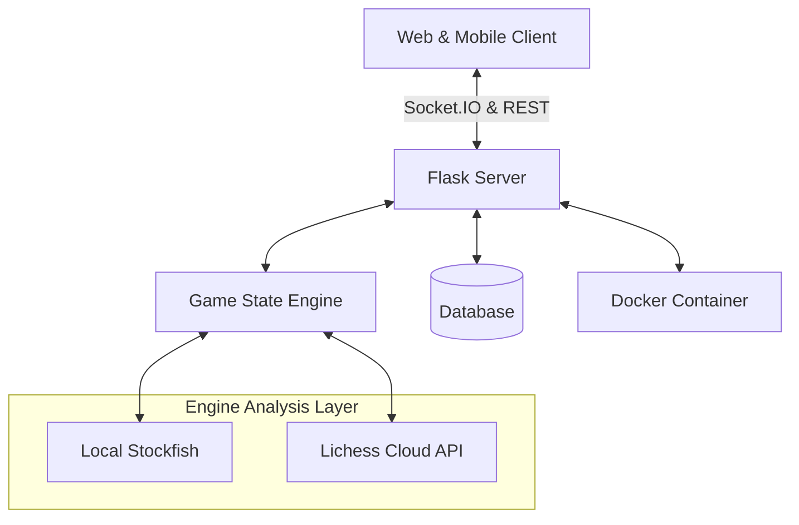

# ♟️ GrandMaster Chess

<div align="center">

### A Professional Full-Stack Real-Time Multiplayer Chess Platform
**Built with Flask, Socket.IO, and Stockfish Engine**

[](https://opensource.org/licenses/MIT)
[](https://www.python.org/downloads/)
[](https://flask.palletsprojects.com/)
[](https://socket.io/)
[](https://www.docker.com/)


[](https://grandmaster-tj4w.onrender.com)

[Features](#-features) • [Quick Start](#-quick-start-docker) • [Tech Stack](#-tech-stack) • [Architecture](#-architecture) • [Roadmap](#-roadmap)

</div>

---

## 🎯 About
**GrandMaster Chess** is a modern, high-performance chess platform featuring a **professional analysis engine**, real-time multiplayer, and a sleek glassmorphism UI. It provides a chess.com-level experience with deep engine insights and smooth, responsive gameplay across all devices.

### 🌟 Key Highlights:
*   **📊 Pro Analysis Mode:** Features a real-time **Evaluation Bar** and **Move Classification** (Brilliant ‼, Great ✓, Blunder ??).
*   **📱 Mobile-First UI:** Fully responsive design with touch gestures, drag-and-drop support, and smooth piece animations.
*   **⚡ Real-time Multiplayer:** Instant sub-second synchronization and live chat using WebSockets and Eventlet.
*   **🤖 Hybrid Stockfish AI:** Intelligent engine layer that uses local binaries (dev) and Cloud API (prod) with 20 difficulty levels.
*   **🏁 Full Rule Compliance:** Complete implementation of FIDE rules including Castling, En Passant, and complex draw detection.

---

## ✨ Features

### 🎮 Versatile Game Modes
| Mode | Description |
| :--- | :--- |
| **Online Multiplayer** | Compete globally with real-time matchmaking and professional ELO tracking. |
| **Advanced Analysis** | Review your games with an engine-powered **Evaluation Bar** and move-by-move quality insights. |
| **Player vs AI** | Challenge Stockfish with levels ranging from "Beginner" to "Super Grandmaster". |
| **Local PvP** | Perfect for over-the-board play on a single tablet or laptop. |

### ⚡ Core Capabilities
<table>
<tr>
<td width="50%">
<strong>🧠 Game Analysis</strong>
<br><br>
• Professional Visual Evaluation Bar<br>
• Move Quality Classification (Brilliant to Blunder)<br>
• Best Move hints and engine suggestions<br>
• Real-time centipawn & mate assessment<br>
• Interactive move-history navigation
</td>
<td width="50%">
<strong>🌐 Online Experience</strong>
<br><br>
• Lag-compensated WebSocket synchronization<br>
• Matchmaking based on ELO (±200 rating range)<br>
• Integrated chat and secure player profiles<br>
• Live clocks with custom increment support<br>
• Rebuildable game state on reconnection
</td>
</tr>
<tr>
<td width="50%">
<strong>🎨 User Experience</strong>
<br><br>
• Premium Glassmorphism UI (Neon-Dark theme)<br>
• Drag-and-drop & Tap-to-Move support<br>
• Smooth piece animations (60fps transitions)<br>
• High-fidelity chess sound engine<br>
• Mobile-optimized board gestures
</td>
<td width="50%">
<strong>🔐 Scale & Deployment</strong>
<br><br>
• Dockerized for instant environment setup<br>
• Gunicorn + Eventlet for high-concurrency sockets<br>
• PostgreSQL ready with SQLAlchemy integration<br>
• Bcrypt security & Email OTP verification<br>
• Optimized for Render/Heroku cloud platforms
</td>
</tr>
</table>

---

## 🚀 Quick Start (Docker)

Launch the entire platform in seconds using Docker:

1. **Clone the repository:**
   ```bash
   git clone https://github.com/PHENOGRAMMER/Chess-Game.git
   cd Chess-Game
   ```

2. **Build and Run:**
   ```bash
   docker build -t grandmaster-chess .
   docker run -p 5000:5000 grandmaster-chess
   ```

3. **Play:**
   Open `http://localhost:5000` in your browser.

---

## 🛠️ Tech Stack

### Backend Infrastructure
*   **Framework:** Flask 3.0 (Python 3.11+)
*   **Real-time:** Flask-SocketIO (WebSocket)
*   **Worker:** Eventlet (High-concurrency async)
*   **Database:** SQLAlchemy (SQLite/PostgreSQL)
*   **Containerization:** Docker

### Frontend Experience
*   **Logic:** Vanilla JavaScript (ES6+)
*   **Interactions:** Custom Drag-and-Drop & Gestures API
*   **Styling:** Modern CSS3 (Variables, Glassmorphism, Responsive Grid)
*   **Animations:** CSS Transforms & Opacity filters

### Chess Intelligence
*   **Engine:** Stockfish 16.1
*   **Strategy:** Hybrid (Local Binary + Lichess Cloud API)
*   **Logic:** Custom Python State Engine (bitboard-inspired logic)

---

## 🏗️ Architecture



---

## 🎯 Roadmap

- [x] Phase 1-4: Core logic, AI, Multiplayer, and ELO System.
- [x] Phase 5: Mobile-first UI overhaul and gesture support.
- [x] Phase 6: Professional Analysis Mode (Eval bar & Move Classification).
- [x] Phase 7: Dockerization and Cloud-deployment optimization.
- [ ] Phase 8: Friend system and custom invitation links.
- [ ] Phase 9: PGN Export and move-by-move detailed report.
- [ ] Phase 10: Global leaderboard and tactical puzzles.

---

## 🤝 Contributing
Contributions are what make the open source community such an amazing place to learn, inspire, and create.
1. Fork the Project
2. Create your Feature Branch (`git checkout -b feature/AmazingFeature`)
3. Commit your Changes (`git commit -m 'Add some AmazingFeature'`)
4. Push to the Branch (`git push origin feature/AmazingFeature`)
5. Open a Pull Request

---

## 📄 License
Distributed under the MIT License. See `LICENSE` for more information.

<div align="center">

Made with ♟️ by **PHENOGRAMMER**

⭐ **Star this repo if you like what you see!** ⭐

</div>
